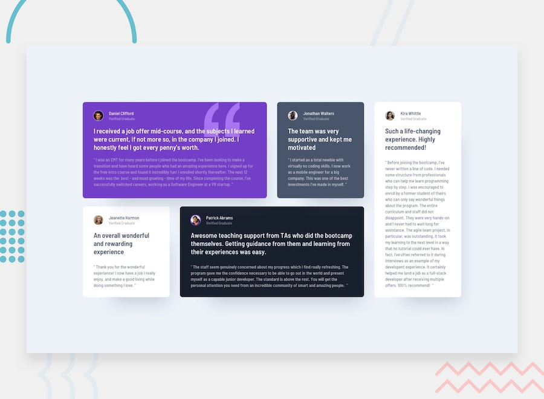
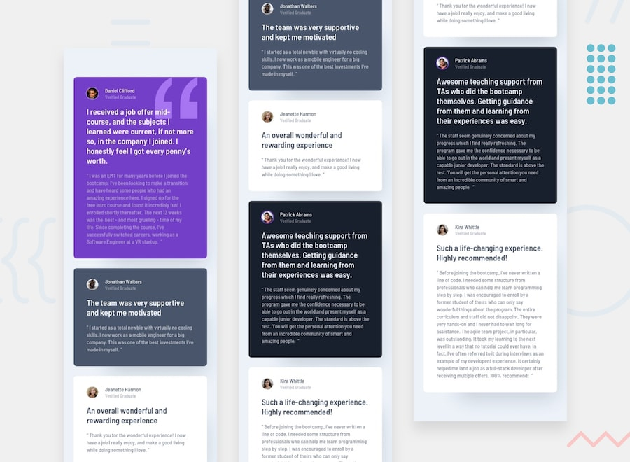
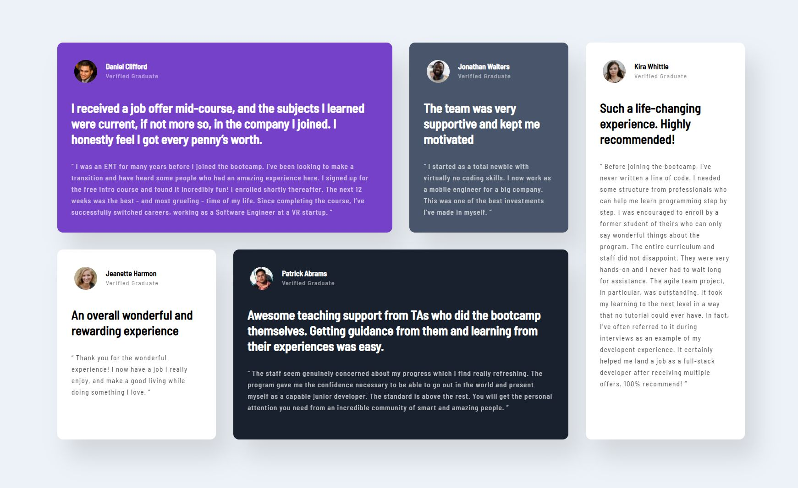
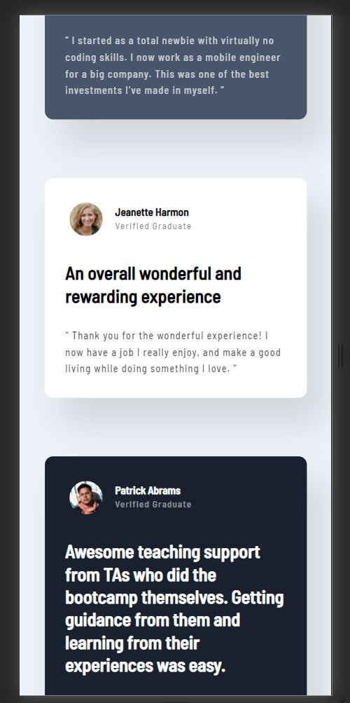

# Frontend Mentor - Testimonials grid section

This front-end coding challenge is from [Frontend Mentor](https://www.frontendmentor.io).

## The challenge

Your challenge is to build out this testimonials grid section and get it looking as close to the design as possible.

## My solution

### Desktop version

### Mobile version

## Challenge specification

The design is to be created to the following widths:

- Mobile: 375px
- Desktop: 1440px

## Colors

### Primary

Moderate violet: hsl(263, 55%, 52%)
Very dark grayish blue: hsl(217, 19%, 35%)
Very dark blackish blue: hsl(219, 29%, 14%)
White: hsl(0, 0%, 100%)

### Neutral

Light gray: hsl(0, 0%, 81%)
Light grayish blue: hsl(210, 46%, 95%)

Note for text colors:

1. "Verified Graduate" has the same color as the person's name with 50% opacity
2. Review paragraphs inside the quotations have the same color as well, but are at 70% opacity

## Typography

### Body Copy

- Font size: 13px

### Font

- Family: [Barlow Semi Condensed](https://fonts.google.com/specimen/Barlow+Semi+Condensed)
- Weights: 500, 600
